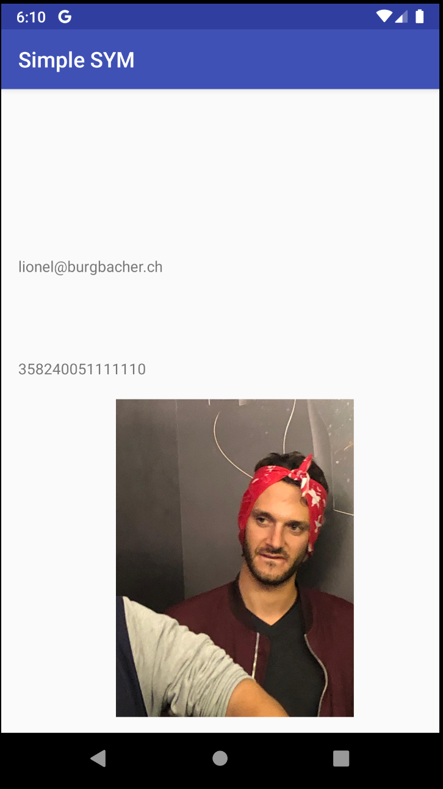
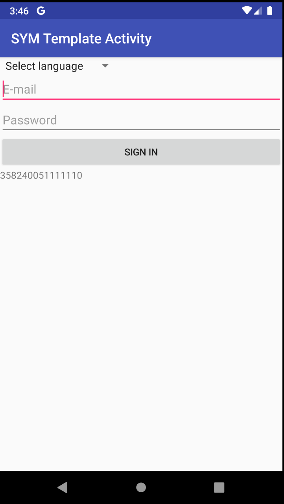
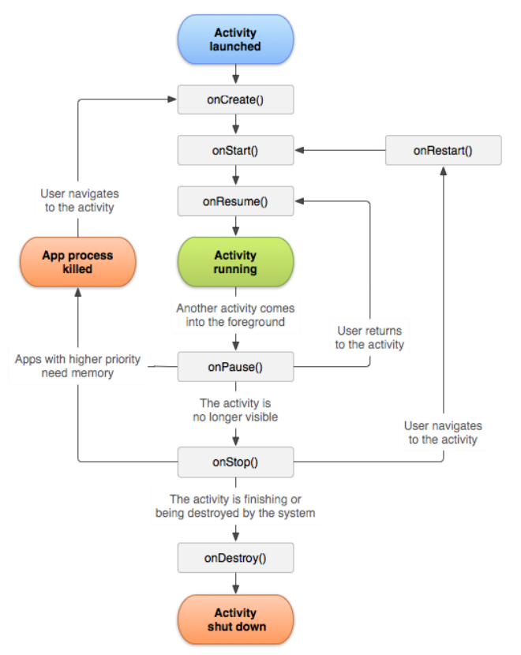

# Systèmes mobiles

## Laboratoire n°1 : Introduction à Android

#### Groupe : Zerbib Jérémy, Jaquet David, Burgbacher Lionel

Concernant la partie avec l'image, vu que l'image est stockée de manière locale, une capture d'écran permet de montrer le résultat. 
On utilise la commande `abd push perso.jpg /sdcard/Dowload/perso.jpg` pour copier l'image sur la *carte sd* et ensuite dans l'activité 2, on vérifie les permissions et si elles ont été acceptées, on affiche l'image.

```java
if (ContextCompat.checkSelfPermission(this, Manifest.permission.READ_EXTERNAL_STORAGE) == PackageManager.PERMISSION_GRANTED) {
    File image = new File(Environment.getExternalStoragePublicDirectory(Environment.DIRECTORY_DOWNLOADS), "perso.jpg");
    ImageView jpgView = findViewById(R.id.imageView);
          jpgView.setImageBitmap(Bitmap.createBitmap(BitmapFactory.decodeFile(image.getAbsolutePath())));
}
```

​		Le résultat est le suivant : 

		

1. Comment organiser les textes pour obtenir une application multi-langues (français, allemand, italien, langue par défaut : anglais) ? Que se passe-t-il si une traduction est manquante dans la langue par défaut ou dans une langue supplémentaire ?

   **Tous les textes doivent être rentrés dans un dossier `values` avec la *locale* correspondante au langage en suffixe. Par exemple, pour ajouter le français, nous pouvons créer un dossier `values-fr` contenant toutes les chaines de caractères de `strings.xml` du dossier original `values`. Dans le cas de l'application, nous avons mis en place des traductions en *français* et en *espagnol*. **

   **Avant une connexion, nous pouvons choisir la langue souhaitée  avec une option supplémentaire : *hindi*. Cette locale n'étant pas disponible, nous retournons la langue par défaut : l'anglais.**

   **De manière plus globale, lorsqu'une traduction n'existe pas, le programme revient automatiquement sur la locale dans le dossier `values` par défaut.**

2. Dans l’exemple fourni, sur le dialogue pop-up, nous affichons l’icône `android.R.drawable.ic_dialog_alert`, disponible dans le SDK *Android* mais qui n’est pas très bien adapté visuellement à notre utilisation. Nous souhaitons la remplacer avec notre propre icône, veuillez indiquer comment procéder. Dans quel(s) dossier(s) devons-nous ajouter cette image ? Décrivez brièvement la logique derrière la gestion des ressources de type « image » sur *Android*.

   **Nous devons créer un dossier `drawable` de façon à pouvoir ajouter notre icône personnalisée. En effet, créer un dossier avec ce nom signifie que nous voulons ajouter un media qui sera de type `Drawable` lors de son utilisation. Le snippet ci-dessous montre l'utilisation faite de notre icône : **

   ```java
   AlertDialog.Builder alertbd = new AlertDialog.Builder(this);
   Drawable myIcon = getResources().getDrawable( R.drawable.popup);
   alertbd.setIcon(myIcon);
   ```

   **La logique veut que toutes les images soient stockées dans un dossier `Drawable` indépendant de l'utilisateur courant. Si nous souhaitons récupérer une information de ce dossier, nous pouvons y accéder via `android.R.` ou en cherchant directement dans les dossiers.**

3. Lorsque le login est réussi, vous êtes censé chaîner une autre Activity en utilisant un Intent. Si je presse le bouton "Back" de l'interface *Android*, que puis-je constater ? Comment faire pour que l'application se comporte de manière plus logique ? Veuillez discuter de la logique derrière les activités *Android*.

   **On constate que l'application a été quittée, cela vient du fait que la méthode `finish()` est appelée et donc que  l'activité n'existe plus. Pour palier à cela, on supprime la ligne qui finit l'activité, donc `finish()`, et on utilise les méthodes setText pour chaque champ. On remplace nos données par des String vides ainsi qu'un nouvel autofocus pour le champ email, ce qui permet de revenir en arrière et de trouver une nouvelle page avec des champs vides.**  

4. On pourrait imaginer une situation où cette seconde Activity fournit un résultat (par exemple l’IMEI ou une autre chaîne de caractères) que nous voudrions récupérer dans l'Activity de départ. Comment procéder ?

   **Dans la première activité, on utilise la méthode `startActivityForResult(intent, 1);`**
   
   **La méthode onActivityResult permet de récupérer les données depuis la seconde activité.**

  ```java
  @Override
  protected void onActivityResult(int requestCode, int resultCode, Intent data) {
     super.onActivityResult(requestCode, resultCode, data);
     String editTextValue = data.getStringExtra("deviceID");
     TextView id = findViewById(R.id.textView3);
     id.setText(editTextValue);
  }
  ```

​	**Dans la seconde activité, on envoie les données à l'activité 1 : **

  ```java
  Intent intentfirst = new Intent();
  intentfirst.putExtra("deviceID", deviceID);
  setResult(1, intentfirst);
  finish();
  ```

  	**Ainsi les données sont récupérées de l'activité 2 dans la première activité  , dans notre exemple, on affiche l'id dans un nouveau champ texte.**

.

5. Vous noterez que la méthode getDeviceId() du TelephonyManager, permettant d’obtenir l’IMEI du téléphone, est dépréciée depuis la version 26 de l’API. Veuillez discuter de ce que cela implique lors du développement et de présenter une façon d’en tenir compte avec un exemple de code.

   **L'implication de l'utilisation d'un code déprécié fait qu'au bout d'un certain temps certaines lignes de code pourraient ne plus marcher. Pour combler cela, il faudrait mettre des conditions quant à l'utilisation de certaines fonctions : ** 

   ```java
   if (ContextCompat.checkSelfPermission(this, Manifest.permission.READ_PHONE_STATE) == PackageManager.PERMISSION_GRANTED) {
       TelephonyManager telephonyManager = (TelephonyManager) getSystemService(Context.TELEPHONY_SERVICE);
   		if (Build.VERSION.SDK_INT >= Build.VERSION_CODES.O){
   			deviceID = telephonyManager.getImei();
   		} else {
   			deviceID = telephonyManager.getDeviceId();
   		}
   } else {
   	deviceID = "Permission is not Granted -> No IMEI to display";
   }
   ```

6. Dans l’activité de login, en plaçant le téléphone (ou l’émulateur) en mode paysage (landscape), nous constatons que les 2 champs de saisie ainsi que le bouton s’étendent sur toute la largeur de l’écran. Veuillez réaliser un layout spécifique au mode paysage qui permet un affichage mieux adapté et indiquer comment faire pour qu’il soit utilisé automatiquement à l’exécution.

   **Pour réaliser un layout spécifique en mode paysage et qu'il soit exécuté automatiquement, il suffit d'ajouter un dossier layout-land dans les ressources. Il suffit maintenant de créer un fichier qui porte le même nom que le mode portait et d'ajouter ces spécificités.** 

7. Le layout de l’interface utilisateur de l’activité de login qui vous a été fourni a été réalisé avec un LinearLayout à la racine. Nous vous demandons de réaliser un layout équivalent utilisant cette fois-ci un RelativeLayout.

   **Cette modification a été faite directement le code du fichier `authent.xml`. On commence par changer la balise `LinearLayout` en `RelativeLayout`, puis on ajoute l'attribut `android:layout_below` avec comme valeur `@id/<id_de_champ>` à chaque champ ou cela est nécessaire. Dans notre cas, ce sont les champs *email*,  *password*, le bouton de connexion ainsi que le `TextView` récupérant les infos de la seconde activité  qui sont concernés. Cela permet de mettre l'objet sur lequel on travaille sous l'objet indiqué à la place de `<id_de_champ>`.**
   
   ```xml
   <?xml version="1.0" encoding="utf-8"?>
   <RelativeLayout xmlns:android="http://schemas.android.com/apk/res/android"
       android:layout_width="match_parent"
       android:layout_height="match_parent"
       android:orientation="vertical" >
   
       <Spinner
           android:id="@+id/spinner"
           android:layout_width="wrap_content"
           android:layout_height="wrap_content" />
   
       <EditText
           android:id="@+id/email"
           android:layout_width="match_parent"
           android:layout_height="wrap_content"
           android:hint="@string/email"
           android:inputType="textEmailAddress"
           android:layout_below="@id/spinner">
           <requestFocus />
       </EditText>
   
       <EditText
           android:id="@+id/password"
           android:layout_width="match_parent"
           android:layout_height="wrap_content"
           android:ems="10"
           android:hint="@string/psw"
           android:inputType="textPassword"
           android:layout_below="@id/email"/>
   
       <Button
           android:id="@+id/buttOk"
           android:layout_width="match_parent"
           android:layout_height="wrap_content"
           android:text="@string/signin"
           android:layout_below="@id/password" />
   
       <TextView
           android:id="@+id/textView3"
           android:layout_width="match_parent"
           android:layout_height="wrap_content"
           android:layout_below="@id/buttOk"/>
   
   </RelativeLayout>
   ```
8. Implémentez dans votre code les méthodes onCreate(), onStart(), onResume(),onPause(), onStop(), etc... qui marquent le cycle de vie d'une application *Android*, et tracez leur exécution dans le logcat. Décrivez brièvement à quelles occasions ces méthodes sont invoquées. Vous expliquerez aussi l’enchainement de ces appels lorsque l’on passe d’une activité à l’autre. Comment pouvez-vous factoriser votre code pour éviter de devoir réimplémenter ces méthodes dans chacune de vos activités ?

    **L'image suivante - tiré du cours SYM de la HEIG-VD et de la documentation officielle - nous aide à comprendre le cycle de vie d'une activité et quelles méthodes sont appelés :**

    

**En affichant un simple message dans le `logcat`, on peut voir facilement le moment d'appel des différentes méthodes. Le nom des méthodes est explicite, mais voici tout de même un explicatif de ces dernières :**

- **`onCreate` : Permet de créer l'activité. Dans le cycle de vie de l'activité, cette méthode n'est appelée qu'une seule fois. Cependant, si une application avec une priorité plus élevée a besoin de mémoire, le processus est tué et l'activité sera re-créer.**

- **`onStart` : Cette fonction est appelé lorsque l'activité devient visible pour l'utilisateur**

- **`onResume` : Méthode appelée lorsque l'activité (re)démarre**

- **`onPause` : Méthode appelée lorsqu'une seconde activité passe en premier plan**

- **`onStop` : Méthode appelée lorsque notre activité n'est plus visible**

- **`onRestart` : Cette méthode est appelé après que la méthode `onStop` a été appelé. L'utilisateur est donc entrain de revenir sur notre activité. La méthode `onStart` sera appellée car l'activité redeviendra visible**

- **`onDestroy` : Notre activité se termine, c'est la dernière méthode appellée avant que l'activité soit tuée**

  **Dans notre cas, une fois connecté, nous ne tuons pas l'activité pour se connecter lors du changement. L'activité de connexion va parcourir toutes les méthodes jusqu'à la méthode `onStop` (y compris). Une fois que l'utilisateur revient sur l'activité principale, le cycle de vie reprend à partir de la méthode `onRestart`.**

  **Voici le code qui a été rajouté pour tracer l'exécution des méthodes décrites précédemment. Ici, nous ajouter juste une *information* dans le `logcat` avec le tag `Lab 01` ainsi qu'une description pour différencier les différentes méthodes.**

```java
// Added in MainActivity.java
@Override
protected void onCreate(Bundle savedInstanceState) {
    super.onCreate(savedInstanceState);
    
    // Log information
    Log.i("Lab 01", "Enter onCreate method");
    
    ...
}

@Override
protected void onStart() {
    super.onStart();

    // Log information
    Log.i("Lab 01", "Enter onStart method");
}

@Override
protected void onResume() {
    super.onResume();

    // Log information
    Log.i("Lab 01", "Enter onResume method");
}

@Override
protected void onPause() {
    super.onPause();

    // Log information
    Log.i("Lab 01", "Enter onPause method");
}

@Override
protected void onStop() {
    super.onStop();

    // Log information
    Log.i("Lab 01", "Enter onStop method");
}

@Override
protected void onRestart() {
    super.onRestart();

    // Log information
    Log.i("Lab 01", "Enter onRestart method");
}

@Override
protected void onDestroy() {
    super.onDestroy();

    // Log information
    Log.i("Lab 01", "Enter onDestroy method");
}
```

**Il est clair que la réimplémentation de ces méthodes n'a pas une grande importance ici. On peut donc se passer de les redéfinir et garder l'implémentation des classes mères (`AppCompatActivity`, `FragmentActivity` et `Activity`).**

**Cependant, si on veut pouvoir écrire dans le `logcat` pour chacune de nos activités, on peut créer une classe que l'on peut nommer `LogActivity` qui hérite de la classe `AppCompatActivity`. Dans cette classe, nous implémentons le code pour écrire dans le `logcat` décrit précédemment. Dans un tel cas, nos classes d'activités doivent hériter de la classe `LogActivity`.**

**Lors de l'écriture dans le `logcat`, on peut également rajouter un appel à la méthode `getClass().getName()` pour afficher le nom de la classe. Grâce à cet ajout et à la liaison dynamique, nous aurons le bon nom de classe dans chacune des classes qui hérite de la classe `LogActivity`.**

9. Question Bonus facultative - S’il vous reste du temps, nous vous conseillons de le consacrer à mettre en place la résolution des permissions au runtime.

    **On utilise la library `Dexter` qui simplifie grandement la manipulation.**

    ```java
    private void requestStoragePermission() {
    
        MultiplePermissionsListener dialogMultiplePermissionsListener =
                DialogOnAnyDeniedMultiplePermissionsListener.Builder
                        .withContext(this)
                        .withTitle("ExternalStorage & PhoneState permission")
                        .withButtonText(android.R.string.ok)
                        .build();
    
        Dexter.withActivity(this)
                .withPermissions(
                        Manifest.permission.READ_EXTERNAL_STORAGE,
                        Manifest.permission.READ_PHONE_STATE
                ).withListener(dialogMultiplePermissionsListener)
                .onSameThread()
                .check();
    }
    ```
    
    **Bien que cela fonctionne, pour afficher directement les données à la première utilisation, on ajoute cette méthode à la première activité. **

